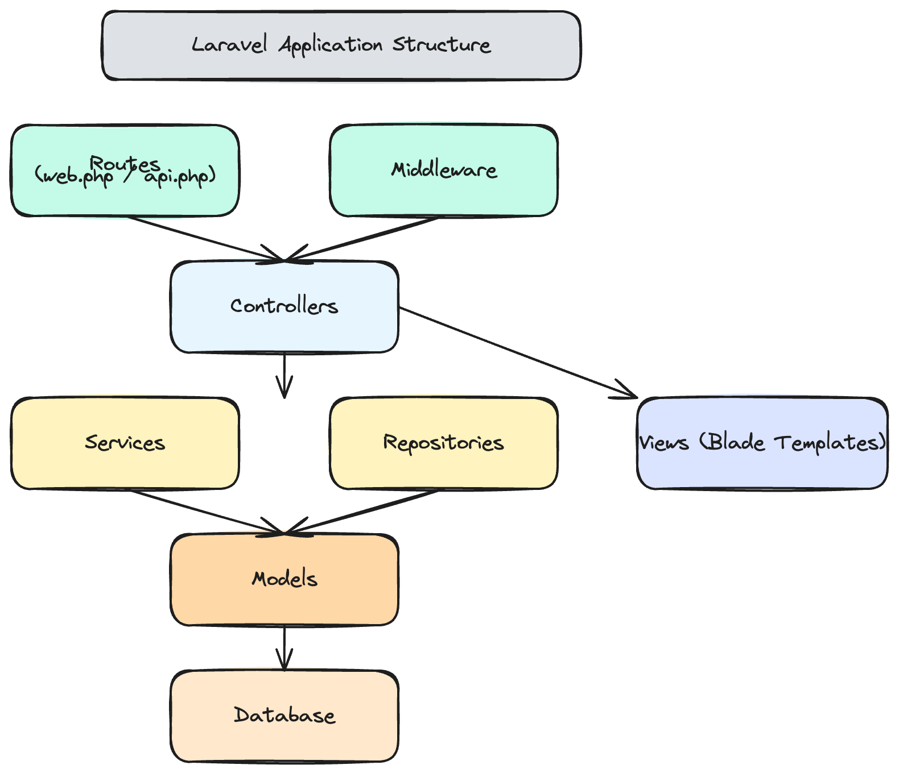
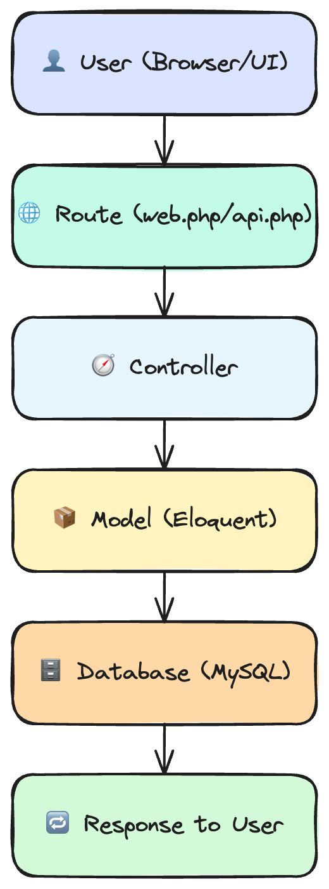

# Laravel Application

## Overview  
This is a Laravel-based application that implements core functionality as shown in the project video.  
It uses standard Laravel architecture (Controllers → Services/Repositories → Models → Views) with RESTful endpoints, authentication & basic UI.

## Features  
- User authentication (login / register)  
- CRUD operations for a main entity  
- API endpoints and web interface  
- Service & repository layers to separate business logic  
- Basic UI views (Blade templates) to list, create, edit, delete items  
- Simple routing with Laravel resource routes  

## Application Structure  
Below is a high-level diagram of the application structure:

## CRUD Structure

## Setup (brief)  
1. Clone the repository  
2. Run `composer install`  
3. Copy `.env.example` → `.env` and set your environment variables  
4. Generate application key: `php artisan key:generate`  
5. Run migrations: `php artisan migrate`  
6. Start local server: `php artisan serve`  

## Usage  
- Register a new user or log in with existing credentials  
- Navigate to the main entity section (e.g. “Items”)  
- Create, view, edit, or delete items via the UI or API endpoints  

## Contribution  
Feel free to open issues or submit pull requests. Please follow PSR-12 coding standards, include tests where appropriate, and update documentation when adding new features.

## License  
This project is licensed under the MIT License — see the `LICENSE` file for details.

